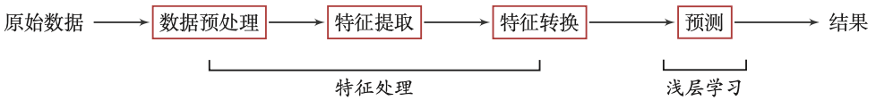
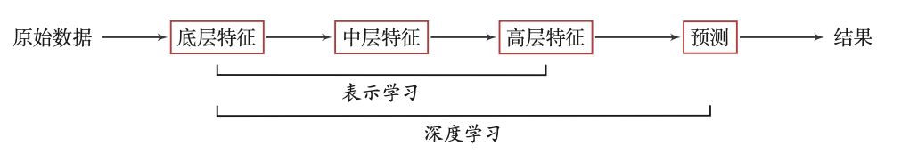

# 机器学习

### 1.  传统机器学习的数据处理流程



### 2.  深度学习的数据处理流程

为了学习一种好的表示，需要构建具有一定“深度”的模型，并通过学习算法 来让模型自动学习出好的特征表示(从底层特征，到中层特征，再到高层特征)， 
从而最终提升预测模型的准确率.所谓“深度”是指原始数据进行非线性特征转换的次数.深度学习采用的模型主要是*神经网络模型*



### 3.  机器学习分类主要有

**监督学习(SupervisedLearning)**
```{.cs}
    分类(Classification)
    回归(Regression)
```
**无监督学习(UnsupervisedLearning):**

    聚类(Clustering)
    降维(DimensionalityReduction)

**半监督学习(Semi-SupervisedLearning)**

    通常应应用在标签不完整的时候
### 4.  sklearn中常用的模块有:

**分类**:

    识别某个对象属于哪个类别
    常用的算法有： SVM（支持向量机）、nearest neighbors（最近邻）、random forest（随机森林）
    常见的应用有：垃圾邮件识别、图像识别。
**回归**：

    预测与对象相关联的连续值属性
    常见的算法有：SVR（支持向量机）、 ridge regression（岭回归）、Lasso
    常见的应用有：药物反应，预测股价。

**聚类**:

    将相似对象自动分组
    常用的算法有：k-Means、 spectral clustering、mean-shift
    常见的应用有：客户细分，分组实验结果。
**降维**：

    减少要考虑的随机变量的数量
    常见的算法有：PCA（主成分分析）、feature selection（特征选择）、 non-negative matrix factorization（非负矩阵分解）
    常见的应用有：可视化，提高效率。
**模型选择**：

    比较，验证，选择参数和模型
    常用的模块有：grid search（网格搜索）、cross validation（交叉验证）、 metrics（度量）
    它的目标是通过参数调整提高精度。
**预处理**：

    特征提取和归一化
    常用的模块有：preprocessing，feature extraction
    常见的应用有：把输入数据（如文本）转换为机器学习算法可用的数据。